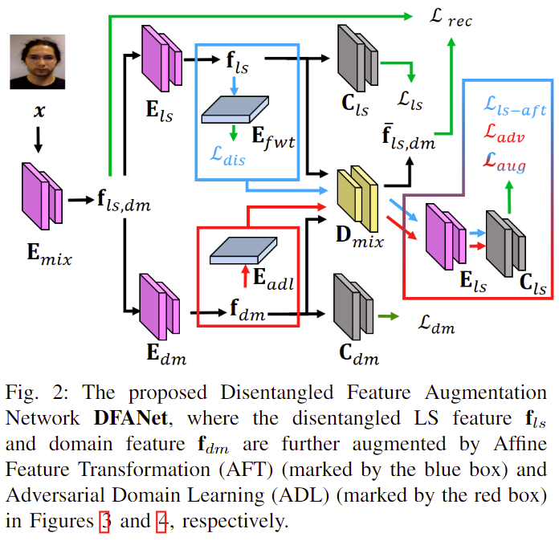
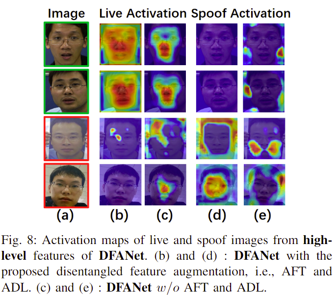

# DFANet
### [Toward Diverse Liveness Feature Representation and Domain Expansion for Cross-Domain Face Anti-Spoofing]


## Network Architecture



## Requirements
```
numpy==1.24.2
scikit_learn==1.2.2
torch==1.12.0
torchvision==0.14.1
```

## Training & Testing
Step 1: run `python train.py` to train the DFANet model.

Step 2: run `python test.py` to test the DFANet model.

## Visualization:




## Citation

If you use the DFANet, please cite the paper:

```
@inproceedings{huang2022towards,
  title={Towards Diverse Liveness Feature Representation and Domain Expansion for Cross-Domain Face Anti-Spoofing},
  author={Huang, Pei-Kai and Chong, Jun-Xiong and Ni, Hui-Yu and Chen, Tzu-Hsien and Hsu, Chiou-Ting},
  booktitle={2023 IEEE International Conference on Multimedia and Expo (ICME)}, 
  year={2023},
  organization={IEEE}
}
```

## Contact us
We are students from MPLAB at National Tsing Hua University.  
Chen, Tzu-Hsien <gapp111062570@gapp.nthu.edu.tw> 
Huang, Pei-Kai <alwayswithme@gapp.nthu.edu.tw>  
Ni, Hui-Yu <huiyu8794@gmail.com>  
Chong, Jun-Xiong <jxchong99@gmail.com>
